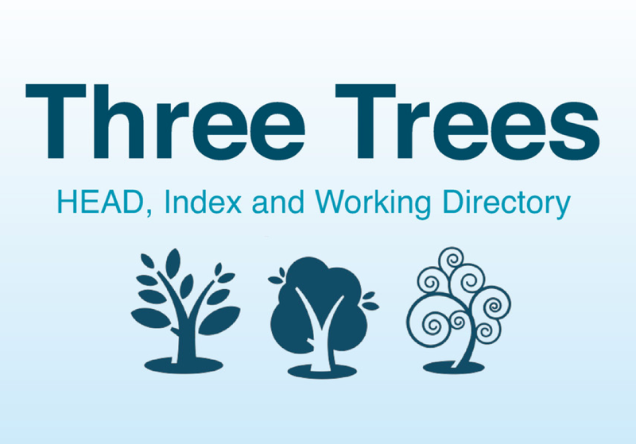
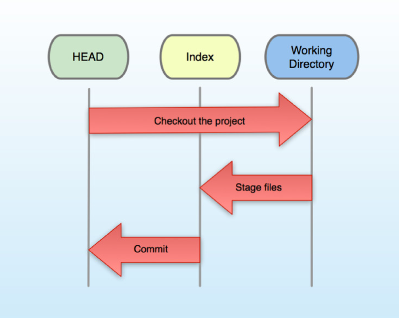
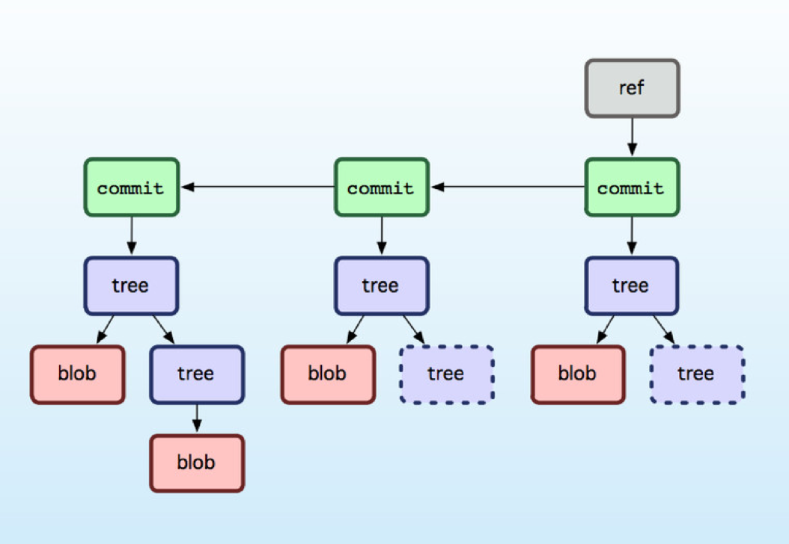
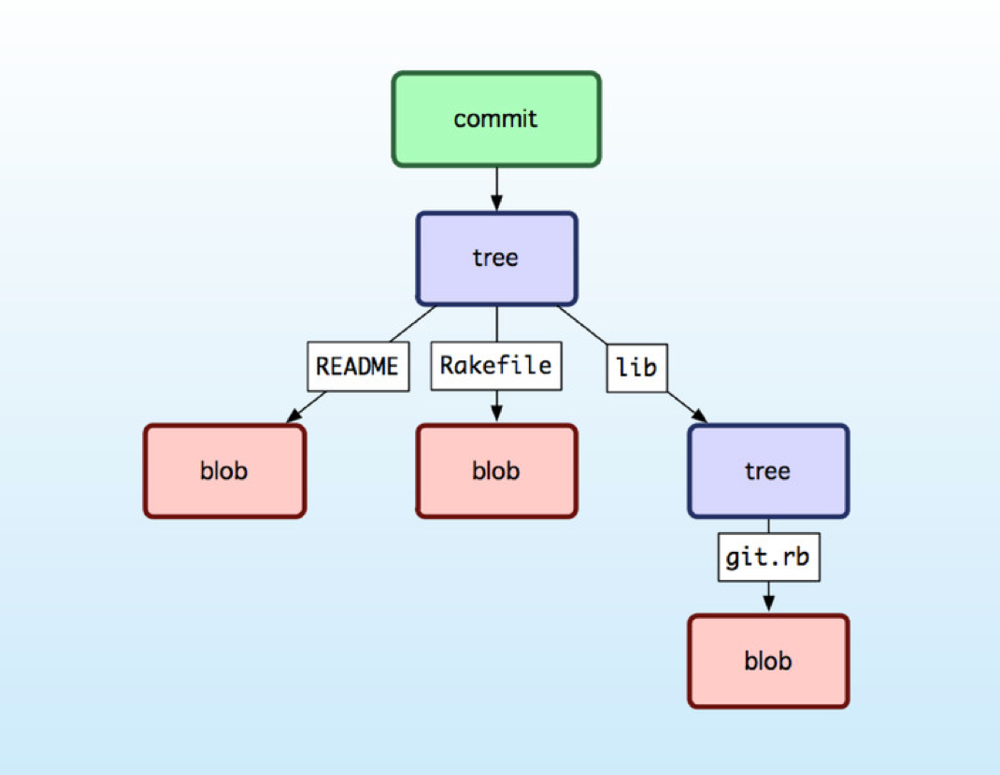
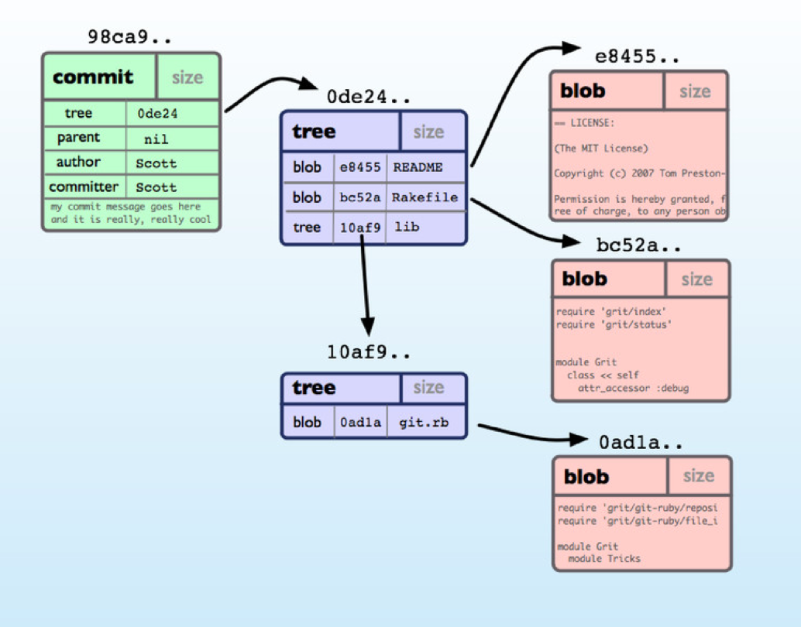
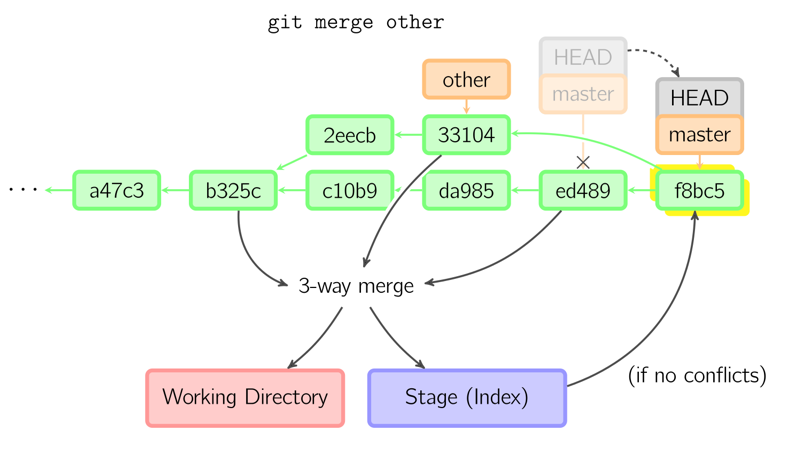
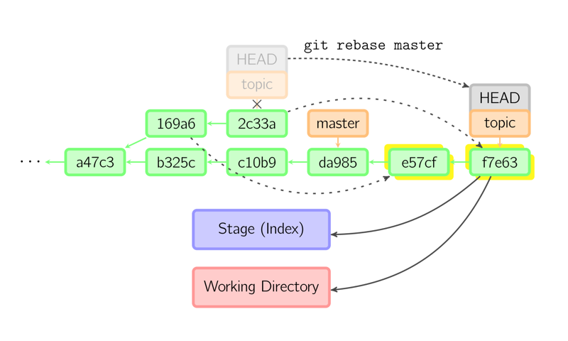

!SLIDE 
# Git #

!SLIDE
# Who am I #

!SLIDE bullets left
# Shawn Anderson #

* Software Developer @ AtomicObject
* User of Git
* shawn42 github/gmail
* @FuzyPinkBunny

!SLIDE bullets
# Source Control Management #

* Definition
* Uses

~~~SECTION:notes~~~
  POLL audience
~~~ENDSECTION~~~

!SLIDE
# What is Git #

~~~SECTION:notes~~~
  POLL: Anyone used Git?
~~~ENDSECTION~~~

!SLIDE bullets
# What is Git #

* version control system
* free
* distributed

!SLIDE bullets small
# Design Goals #

* Speed
* Simple design
* Non-linear development
* Fully distributed
* Large projects

~~~SECTION:notes~~~
  Built by Linus Torvalds
~~~ENDSECTION~~~

!SLIDE bullets small
# Versus SVN
* Distributed vs Centralized
* Larger repositories
* Larger teams
* Real branches
* More complicated

!SLIDE
# Using SVN after Git #

!SLIDE bullets
# Why Distributed? #

* Work offline
* Local branching
* Every clone is a backup (_why)
* Speed

~~~SECTION:notes~~~
  no network: diff / history / commit / merge / old versions / switching branches / etc
~~~ENDSECTION~~~

!SLIDE
# Installed? #

!SLIDE small
# Configuration #

	@@@ bash 
		$ git config --global user.name "Your Name"
		$ git config --global user.email "you@example.com"

!SLIDE bullets
# Configuration #

* .gitconfig
* .gitignore
* system, global, or local

!SLIDE small
# New Repository #

	@@@ bash 
		$ mkdir thinger
		$ cd thinger
		$ git init

~~~SECTION:notes~~~
  created the .git directory
~~~ENDSECTION~~~

!SLIDE
# Add new file in SVN? #

!SLIDE
# @chacon #

~~~SECTION:notes~~~
  graphics stolen from Scott Chacon, githubber / training
~~~ENDSECTION~~~

!SLIDE
# Local Trees #

~~~SECTION:notes~~~
  SVN just has one local tree
~~~ENDSECTION~~~

!SLIDE
# Why trees? #

!SLIDE

!SLIDE

!SLIDE

~~~SECTION:notes~~~
  Split into group for each tree
~~~ENDSECTION~~~

!SLIDE
# New file #

	@@@ bash 
		$ touch boring_homework_1.txt
		$ git status

!SLIDE
# New file #

	@@@ bash 
		$ git add boring_homework_1.txt
		$ git status

!SLIDE
# New file #

	@@@ bash 
		$ git reset
		$ git status

!SLIDE
# New file #

	@@@ bash 
		$ git add boring_homework_1.txt
		$ git commit
		$ git status

!SLIDE
# New file #

	@@@ bash 
		$ git log
		$ git show <SHA1>
~~~SECTION:notes~~~
  SHA1 or shortened / describe ref
~~~ENDSECTION~~~

!SLIDE
# Remove the file #

	@@@ bash 
		$ git rm boring_homework_1.txt
		$ git status
~~~SECTION:notes~~~
  only staged, not committed
~~~ENDSECTION~~~

!SLIDE
# Remove the file #

	@@@ bash 
		$ git reset
		$ git status

!SLIDE
# Remove the file #

	@@@ bash 
		$ git checkout boring_homework_1.txt
		$ git status

!SLIDE
# Remove the file #

	@@@ bash 
		$ git rm boring_homework_1.txt
		$ git commit
		$ git status

!SLIDE bullets
# Add file #

* Create boring\_homework\_2.txt with text in it
* Commit it to the repo

!SLIDE
# Making changes #

	@@@ bash 
		$ <editor> boring_homework_2.txt
		$ git status

!SLIDE bullets
# EMERGENCY!!! #

* Drop what you're doing and fix BUG XYZ

!SLIDE
# Yay for stash #

	@@@ bash 
		$ git stash
		$ git status

~~~SECTION:notes~~~
  watch out for untracked files! git add first
~~~ENDSECTION~~~

!SLIDE
# Resume boring homework.. #

	@@@ bash 
		$ git stash pop
		$ git status

!SLIDE
# What did I change again? #

	@@@ bash 
		$ git diff

!SLIDE
# Commit your changes #

!SLIDE bullets
# Play time #

* Add / remove some files
* modify some files
* try out the revert command
* try out the mv command

!SLIDE
# Branches #

	@@@ bash 
		$ git branch

!SLIDE
# Branching out #

	@@@ bash 
		$ git checkout -b other
		$ git branch

~~~SECTION:notes~~~
  checkout basically means move HEAD
~~~ENDSECTION~~~

!SLIDE bullets
# Play time #

* Add / remove some files
* modify some files
* commit

!SLIDE
# Back to master #

	@@@ bash 
		$ git checkout master

!SLIDE bullets
# Play time #

* modify some files
* commit

!SLIDE bullets
# Worls collide #

* Merge vs Rebase

!SLIDE 
# Merge #

!SLIDE 
# Rebase #

!SLIDE small
# Let's merge #

	@@@ bash 
		$ git merge other
		$ git log
		$ git log --graph --pretty=oneline --decorate --abbrev-commit

!SLIDE bullets
# Extra credit #

* revert a branch merge?

!SLIDE
# Delete it #

	@@@ bash 
		$ git branch -D other

!SLIDE
# Remotes! #

~~~SECTION:notes~~~
  Photo Credit: https://www.flickr.com/photos/paulm/398153054
~~~ENDSECTION~~~

!SLIDE bullets
# Easiest way to have a remote #

* clone from a remote

!SLIDE
# Cloning is totally safe #

	@@@ bash 
		$ git clone https://bitbucket.org/
		 shawn_42/git_workshop.git

!SLIDE small
# Long winded version #

	@@@ bash 
		$ mkdir git_workshop; cd git_workshop
		$ git init
		$ git remote add origin https://bitbucket.org/
          shawn_42/git_workshop.git
		$ git fetch origin
		$ git checkout master

!SLIDE bullets
# Fetch #

* fetches data from the remote
* doesn't do anything with it

!SLIDE bullets
# Pull #

* fetch + merge
* can do rebase instead

!SLIDE bullets
# Push #

* pushes your changes if your local is up to date
* yells at you if it isn't

!SLIDE
# Push new branch #

	@@@ bash 
		$ git checkout -b feature_x
		$ git push -u origin feature_x

!SLIDE
# Pull on your branch #

	@@@ bash 
		$ git pull

!SLIDE 
# Nuke a remote branch #

	@@@ bash 
		$ git push origin --delete other

~~~SECTION:notes~~~
  Other clones will maintain any local branches
~~~ENDSECTION~~~

!SLIDE bullets
# Experiment #

* Groups, push remote repos to bitbucket
* Try to break things, conflicts.. rewrite history.. etc
* We'll see what happens

!SLIDE bullets
# Workflows #

* Github flow
* Git flow
* centralized (SVN-esque)
* feature branch
* forking workflow (branch pulling)

!SLIDE bullets
# Github flow #

* master is always deployable
* create new branch for feature
* commit locally and push branch to origin
* open pull request
* deploy master

!SLIDE bullets
# Git flow #

* See diagrams

!SLIDE bullets
# Extras #

* tags
* git-extras
* aliases
* submodules
* GUI tools

!SLIDE bullets small
# Resources #

* https://github.com/visionmedia/git-extras
* http://marklodato.github.io/visual-git-guide/index-en.html
* http://git-scm.com/book/en/Getting-Started-Git-Basics
* http://www.git-tower.com/blog/git-cheat-sheet-detail/
* https://www.atlassian.com/git/workflows#!workflow-overview
* http://gitref.org

